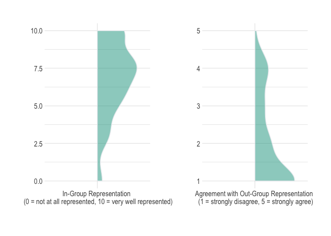
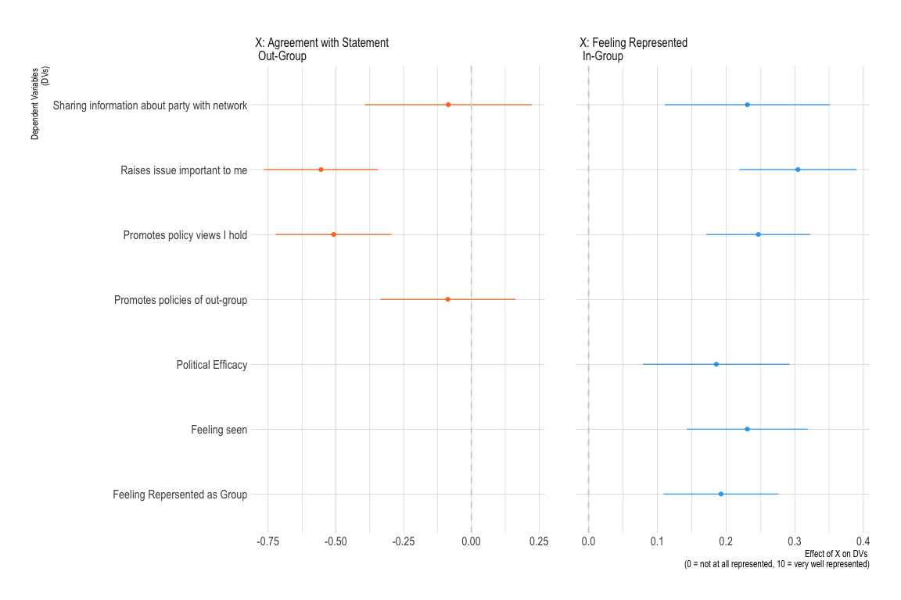
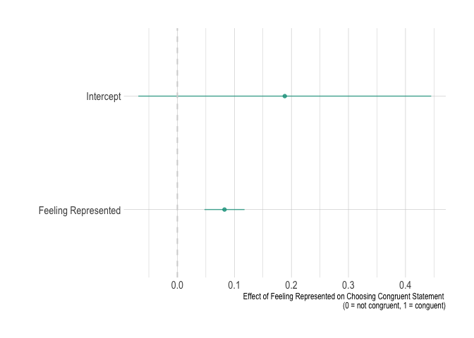

Prepare Data - Pilot Study
================

- [Required Packages &
  Reproducibility](#required-packages--reproducibility)
- [Tidy Data](#tidy-data)
- [Distributions of Representation for In- &
  Out-Groups](#distributions-of-representation-for-in---out-groups)
- [Policy vs Group Representation](#policy-vs-group-representation)
- [Preference for Statement](#preference-for-statement)

## Required Packages & Reproducibility

``` r
rm(list=ls())
source(here::here("src/lib/functions.R"))
#renv::snapshot()
```

## Tidy Data

``` r
 source(here("src/data-processing/clean_pilot.R"))
```

# Distributions of Representation for In- & Out-Groups

``` r
source(here("src/data-processing/distributions.R"))
p1 + p2
```



# Policy vs Group Representation

``` r
source(here("src/analysis/treatment_checks.R"))
p3
```



# Preference for Statement

``` r
source(here("src/analysis/statement_choice.R"))
p4
```


